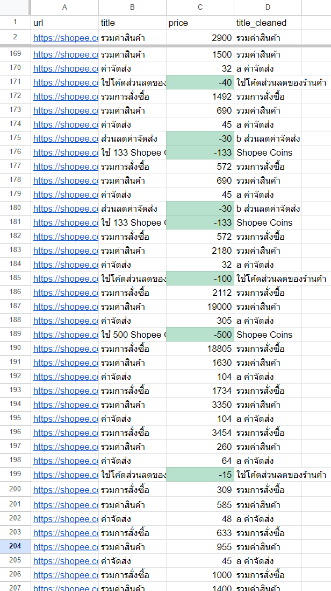
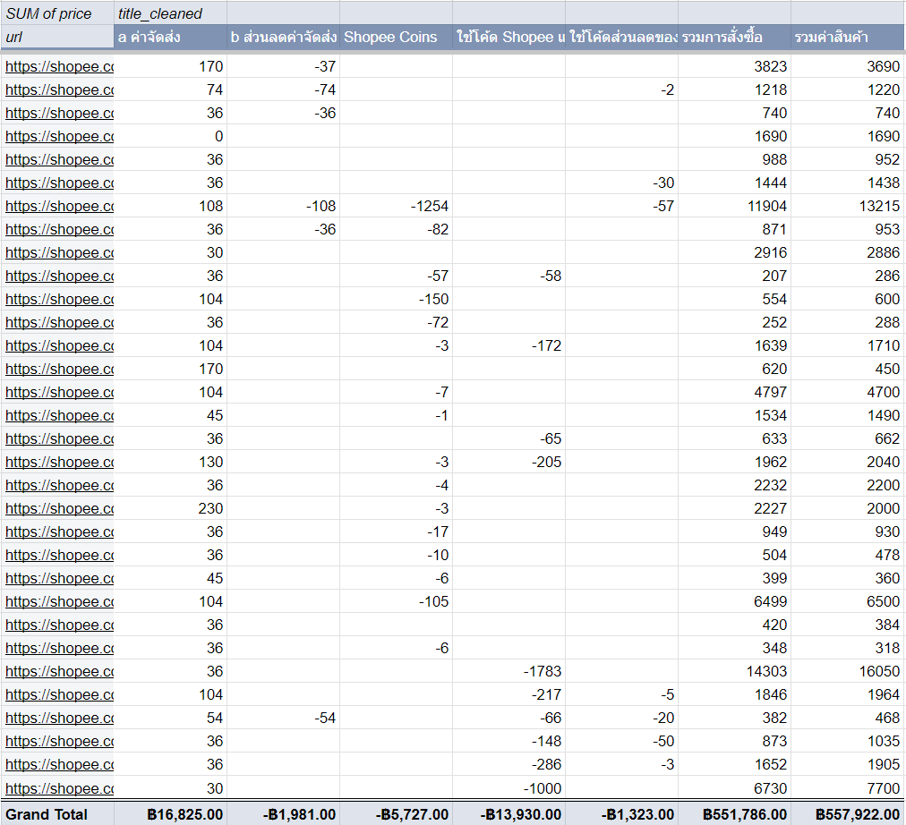
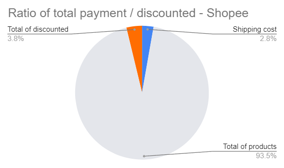

# Shopee - web scrapping python

This Markdown file provides an overview of the Shopee web scraping project. It covers the purpose, methodology, and key findings of the project, highlighting the insights gained from scraping data from the Shopee platform.

## Code to scrape Purchased Data from Shopee

[Link to Scrape Purchased Data from Shopee.ipynb](Scrape%20Purchased%20Data%20from%20Shopee.ipynb)

## Scraped Purchased Data CSV file from Shopee

[Link to Shopee_Purchased.csv](./Shopee_Purchased.csv)

### Import csv into Google Sheets for Data Analytics

- There will be 3 columns in the csv file: url, title, price
- But we need to clean up the title column -> title cleaned
- Highlight the discounted price from Shopee orders

### Turn the data table into a Pivot Table

### Generate some charts from the Pivot Table

The pie chart illustrates that the discounted price from Shopee orders can cover 3.8 percent of the product price, effectively reducing the shipping cost.
This highlights the significance of discounts for Shopee buyers as they can help minimize shipping expenses.

